  <picture>
    <source media="(prefers-color-scheme: dark)" srcset="assets/hero-dark.svg">
    <source media="(prefers-color-scheme: light)" srcset="assets/hero-light.svg">
    
  </picture>

 

---

### 👨‍💻 About Me

* 🎓 **Engineering Student** building practical applications across AI/ML, full-stack development, and data analytics.
* 🔧 **Builder at Heart** — I enjoy turning ideas into working products rather than stopping at prototypes.
* 🌐 **Full-Stack & Systems** — Hands-on experience with React, TypeScript, Tailwind CSS, Node.js, Supabase, and SQL.
* 🚀 **Currently Building** — [RecoverAI](https://github.com/Adithyabk01/RecoverAI), [Kisan-Sethu](https://github.com/Adithyabk01/Kisan-Sethu), and healthcare-focused applications.

---

### 🚀 Primary Featured Projects

<!-- Special Visual Emphasis Banner for RecoverAI -->

  <table width="100%">
    <tr>
      <td width="100%" bgcolor="#0d1117" style="border: 2px solid #38bdf8; border-radius: 8px; padding: 18px;">
        <h3 align="left">⚡ FEATURED SPOTLIGHT: RecoverAI — AI Revenue Recovery Agent</h3>
        
<b>🏆 Razorpay Buildathon — Track 03: AI Revenue Recovery</b>

        
An AI-driven revenue recovery system that detects failed payment transactions, analyzes churn risk patterns, and automates customer engagement workflows to maximize payment completion rates.

        

          <code>TypeScript</code> • <code>React</code> • <code>Tailwind CSS</code> • <code>Vite</code> • <code>FinTech AI</code>
        

        

          <a href="https://github.com/Adithyabk01/RecoverAI"><b>📂 View GitHub Repository »</b></a>
        

      </td>
    </tr>
  </table>

 

<!-- 2x2 Grid of Primary Featured Repositories -->
<table width="100%">
  <tr>
    <td width="50%" valign="top" style="padding: 12px;">
      <h3 align="left">🌾 Kisan-Sethu</h3>
      
<b>Agricultural Digital Bridge Platform</b>

      
Connecting agricultural communities with real-time crop management tools and digital market access.

      
<code>TypeScript</code> • <code>Python</code> • <code>Shell</code>

      
<a href="https://github.com/Adithyabk01/Kisan-Sethu"><b>View Code »</b></a>

    </td>
    <td width="50%" valign="top" style="padding: 12px;">
      <h3 align="left">🩺 mediread-web</h3>
      
<b>Medical Prescription &amp; Document Reader</b>

      
Digitizing health records and streamlining prescription readability for patients and practitioners.

      
<code>React</code> • <code>JavaScript</code> • <code>Vite</code>

      

        <a href="https://github.com/Adithyabk01/mediread-web"><b>View Code</b></a> | 
        <a href="https://mediread-web.vercel.app/"><b>Live Demo ✨</b></a>
      

    </td>
  </tr>
  <tr>
    <td width="50%" valign="top" style="padding: 12px;">
      <h3 align="left">🌐 Portfolio</h3>
      
<b>Personal Developer Portfolio</b>

      
An interactive, responsive portfolio showcase displaying featured projects, technical skills, and domain focus.

      
<code>JavaScript</code> • <code>React</code> • <code>CSS3</code>

      

        <a href="https://github.com/Adithyabk01/Portfolio"><b>View Code</b></a> | 
        <a href="https://portfolio-adithyabk01s-projects.vercel.app/"><b>Live Demo ✨</b></a>
      

    </td>
    <td width="50%" valign="top" style="padding: 12px; border: 1px stroke #38bdf8;">
      <h3 align="left">⚡ RecoverAI</h3>
      
<b>AI Revenue Recovery Agent</b>

      
Autonomous AI revenue recovery platform built for Razorpay Buildathon to recover failed payment revenue.

      
<code>TypeScript</code> • <code>React</code> • <code>Tailwind CSS</code>

      
<a href="https://github.com/Adithyabk01/RecoverAI"><b>View Code »</b></a>

    </td>
  </tr>
</table>

<b>🔍 View More Projects</b>

 

* 🌿 **[vedam-nutri-plan (AyurSwasthya)](https://github.com/Adithyabk01/vedam-nutri-plan)** — AI-powered holistic Ayurvedic care platform featuring role-based access, dosha balance visualization, and nutrient analysis. (*TypeScript, React, Supabase*) | [Live Demo ✨](https://vedam-nutri-plan.vercel.app/)
* 🤖 **[six7ven-ai-nexus](https://github.com/Adithyabk01/six7ven-ai-nexus)** — Interactive AI platform hub with 3D visuals and analytics dashboards. (*TypeScript, Three.js, Recharts*) | [Live Demo ✨](https://six7ven-ai-nexus.vercel.app/)
* 📊 **[Startup-Investment-Analysis](https://github.com/Adithyabk01/Startup-Investment-Analysis)** — Data analysis exploration on startup funding and investment trends.
* 🕷️ **[web-scrapping](https://github.com/Adithyabk01/web-scrapping)** — Data collection and automated web scraping notebooks in Python & Jupyter.

---

### 💻 Technologies & Tooling

#### Languages & Core

#### Frontend & UI

#### Backend, Data & Platform

---

### 📊 Capability Radar & Language Breakdown

  <table width="100%">
    <tr>
      <td width="50%" align="center" valign="top">
        <picture>
          <source media="(prefers-color-scheme: dark)" srcset="assets/skill-radar-dark.svg">
          <source media="(prefers-color-scheme: light)" srcset="assets/skill-radar-light.svg">
          
        </picture>
      </td>
      <td width="50%" align="center" valign="top">
        <picture>
          <source media="(prefers-color-scheme: dark)" srcset="assets/languages-dark.svg">
          <source media="(prefers-color-scheme: light)" srcset="assets/languages-light.svg">
          
        </picture>
      </td>
    </tr>
  </table>

---

### 📈 Contribution Activity

  <picture>
    <source media="(prefers-color-scheme: dark)" srcset="assets/snake-dark.svg">
    <source media="(prefers-color-scheme: light)" srcset="assets/snake-light.svg">
    
  </picture>

---

  
<i>Building and learning every day • Reach out via my portfolio or GitHub!</i>

